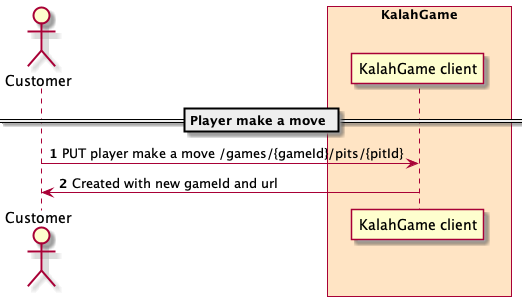

# Kalah Game
This a simple POC a game in rest format.  
This is a game of 6-stone Kalah.
Wikipedia: https://en.wikipedia.org/wiki/Kalah.

### API documentation
Normally a good practise would be to first crate the api documentation.
For example using an [OpenAPI](https://www.openapis.org/)

#### Create new game


#### Make a move


### Play the game
There were no UI requirements.
For an issue play Postman collections can be used. Default port is set to 8081. (http://localhost:8081)
Load collection [Kalah.postman_collection](./postman/Kalah.postman_collection.json)
Then using one of a plugin to generate respective API interface for implementation.
* [Open Api Generator](https://github.com/OpenAPITools/openapi-generator/tree/master/modules/openapi-generator-maven-plugin)
* [BOAT - backbase-openapi-tools](https://github.com/Backbase/backbase-openapi-tools)
* any other...

My preference would be a BOAT plugin as it's really simple a cover mostly all needed cases out of the box

## About the game
>The player who begins picks up all the stones in any of their own pits, and sows the stones on to the right, one in each of the following pits, including his own Kalah. No stones are put in the opponent's' Kalah. If the players last stone lands in his own Kalah, he gets another turn. This can be repeated any number of times before it's the other player's turn.
>
>When the last stone lands in an own empty pit, the player captures this stone and all stones in the opposite pit (the other players' pit) and puts them in his own Kalah.
>
>The game is over as soon as one of the sides run out of stones. The player who still has stones in his/her pits keeps them and puts them in his/hers Kalah. The winner of the game is the player who has the most stones in his Kalah


## Install & Running

### Prerequisites
* [Java 17](http://www.oracle.com/technetwork/java/javase/downloads/index.html)  - Programming language
* [Maven 3.5.0](https://maven.apache.org/download.cgi) - Build tool

### Pull from git
```
$ git clone https://github.com/Aboruhen/kalah.git
$ cd kalah
```

### Build & run

* How to manage different java versions 
```
$ sdk list java
$ sdk install java 17.0.1-oracle
$ sdk use java  17.0.1-oracle
```

* Run test
```
$ mvn test
```

* Run the web server on dev mode
```
$ mvn spring-boot:run
```

## Built With
* [Spring boot 2.5.6](https://projects.spring.io/spring-boot/) -Backed Framework
* [Maven](https://maven.apache.org/) - Dependency Management

